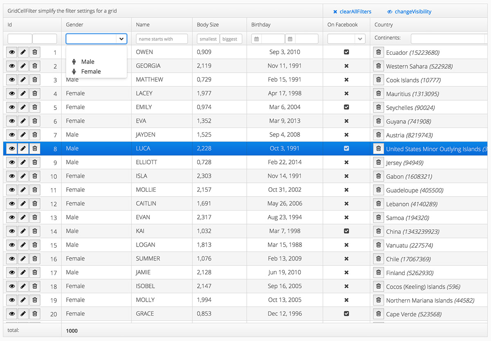

[](https://vaadin.com/directory/component/gridutil)
[](https://vaadin.com/directory/component/gridutil)
[](https://vaadin.com/directory/component/gridutil)

Vaadin GridUtil
==============

A Toolkit that simplify the use of the Grid and add missing features. 



- introduce a easy way to build a filterrow
- add renderers that allows to display a combination of button and value within one cell (missing edit/delete button)
- shorten the lines of code for writing StringConverter
- add missing css-settings for cell alignment

The GridCellFilter-Component contains filters for the following types:
- String
- Date
- Number (checks if Integer, Long, Double...)
- Objects / Enums (via ComboBox with Equals-Filter)
- allows to add custom Filters and Components

For detailed code-example please take a look in the github demo-application. There I've tried to structure my code so that you can understand the usage and the features...

Workflow
========

Add the dependency to your pom the GWT inherits will get automatically added by the maven-vaadin-plugin.

```xml
<dependency>
    <groupId>org.vaadin.addons</groupId>
    <artifactId>vaadin-grid-util</artifactId>
    <version>${vaadin-grid-util-version}</version>
</dependency>
```

```xml
<inherits name="org.vaadin.gridutil.WidgetSet" />
```

Details to the addon you can find on [Vaadin](https://vaadin.com/directory#!addon/gridutil)

Filtering
========
Design your Grid as usual. In order to assign a Filter HeaderRow go like this:

```java
// init filter this add's a HeaderRow to the given grid
final GridCellFilter filter = new GridCellFilter(grid);
filter.setNumberFilter("id");

// set gender Combo with custom icons
ComboBox genderCombo = filter.setComboBoxFilter("gender", Arrays.asList(Gender.MALE, Gender.FEMALE));
genderCombo.setItemIcon(Gender.MALE, FontAwesome.MALE);
genderCombo.setItemIcon(Gender.FEMALE, FontAwesome.FEMALE);

// simple filters
filter.setTextFilter("name", true, true);
filter.setNumberFilter("bodySize");
filter.setDateFilter("birthday");
filter.setBooleanFilter("onFacebook");
```

The GridCellFilter allows to clear all filters and supports a Listener mode:

```java
// init filter this add's a HeaderRow to the given grid
new Button("clearAllFilters", new Button.ClickListener() {
	@Override
	public void buttonClick(final ClickEvent event) {
		filter.clearAllFilters();
	}
});
// listener's on filter
filter.addCellFilterChangedListener(new CellFilterChangedListener() {
	@Override
	public void changedFilter(final GridCellFilter cellFilter) {
		Notification.show("cellFilter changed " + new Date().toLocaleString(), Type.TRAY_NOTIFICATION);
	}
});
```

Renderer
========
The missing feature of adding generatedColumns to a Grid especially in combination with BeanItemContainer leads me to the development of a Render in order to combine avalue and buttons within one cell.
This allows to easily display for example the ID-Column incudling buttons for edit and/or delete.

```java
grid.getColumn("id")
		.setRenderer(new EditDeleteButtonValueRenderer(new EditDeleteButtonClickListener() {

			@Override
			public void onEdit(final RendererClickEvent event) {
				Notification.show(event.getItemId()
						.toString() + " want's to get edited", Type.HUMANIZED_MESSAGE);
			}

			@Override
			public void onDelete(final com.vaadin.ui.renderers.ClickableRenderer.RendererClickEvent event) {
				Notification.show(event.getItemId()
						.toString() + " want's to get delete", Type.WARNING_MESSAGE);
			};

		}))
		.setWidth(200);
```

A single edit *(EditButtonValueRenderer)* or delete *(DeleteButtonValueRenderer)* button renderer is also available.

When you want to create your own icon button you can do so by overwriting the css of the button
*Badfully you cannot set the styleName via the Renderer that's why you need to overwrite it...*

```java
// first of all you need to set a custom style to the column
grid.setCellStyleGenerator(new CellStyleGenerator() {
	@Override
	public String getStyle(final CellReference cellReference) {
		if (cellReference.getPropertyId()
				.equals("country")) {
			return "link-icon";
		} else {
			return null;
		}
	}
});
```
```css
// you need to add this stylesheet to your application
.v-grid-cell.link-icon .v-button-bar button.v-edit span:before {
  color: blue; /* recolor icon */
  content: "\f0c1"; /* content-code of FontAwesome that is served by vaadin! */
}
```

Further more a BooleanRenderer that will convert the values into FontAwesome Icons is included.

Converter
========

In order to reduce lines of code a SimpleStringConverter is introduced:

```java
// shorter Convert version for Object to HTML convertion e.g.
grid.addColumn("country", Country.class)
		.setRenderer(new HtmlRenderer(), new SimpleStringConverter<Country>(Country.class) {
			@Override
			public String convertToPresentation(final Country value, final Class<? extends String> targetType, final Locale locale)
					throws com.vaadin.data.util.converter.Converter.ConversionException {
				return String.format("%s <i>(%d)</i>", value.getName(), value.getPopulation());
			}
		});
		
// old version
grid.addColumn("country", Country.class)
		.setRenderer(new HtmlRenderer(), new Converter<String,Country>() {
			@Override
			public String convertToPresentation(final Country value, final Class<? extends String> targetType, final Locale locale)
					throws com.vaadin.data.util.converter.Converter.ConversionException {
				return String.format("%s <i>(%d)</i>", value.getName(), value.getPopulation());
			}
			@Override
			public Country convertToModel(String value, Class<? extends Country> targetType, Locale locale)
					throws com.vaadin.data.util.converter.Converter.ConversionException {
				return null;
			}
			@Override
			public Class<Country> getModelType() {
				return Country.class;
			}
			@Override
			public Class<String> getPresentationType() {
				return String.class;
			}
		});
```

The MIT License (MIT)
-------------------------

Copyright (c) 2015 Non-Rocket-Science.com

Permission is hereby granted, free of charge, to any person obtaining a copy
of this software and associated documentation files (the "Software"), to deal
in the Software without restriction, including without limitation the rights
to use, copy, modify, merge, publish, distribute, sublicense, and/or sell
copies of the Software, and to permit persons to whom the Software is
furnished to do so, subject to the following conditions:

The above copyright notice and this permission notice shall be included in all
copies or substantial portions of the Software.

THE SOFTWARE IS PROVIDED "AS IS", WITHOUT WARRANTY OF ANY KIND, EXPRESS OR
IMPLIED, INCLUDING BUT NOT LIMITED TO THE WARRANTIES OF MERCHANTABILITY,
FITNESS FOR A PARTICULAR PURPOSE AND NONINFRINGEMENT. IN NO EVENT SHALL THE
AUTHORS OR COPYRIGHT HOLDERS BE LIABLE FOR ANY CLAIM, DAMAGES OR OTHER
LIABILITY, WHETHER IN AN ACTION OF CONTRACT, TORT OR OTHERWISE, ARISING FROM,
OUT OF OR IN CONNECTION WITH THE SOFTWARE OR THE USE OR OTHER DEALINGS IN THE
SOFTWARE.

